# Solving N - Arm Bandits Problem Using Reinforcement Learning

This article primarily follows the ideas and tries to replicate results from **Reinforcement Learning: An Introduction**, book by Andrew Barto and Richard S. Sutton. The objective here is to further simplify the concepts by showing code implementations which can make the learning a lot easier. There might also be some additional concepts which are not covered in the said book.

Before solving multi-arm bandits problem or n-bandits problem, let us familiarize ourselves with some of the basic RL foundations. 

## The Reinforcement Learning Problem  

Reinforcement Learning (RL) in simple sense is a problem where an agent interacts with the environment and takes actions that affect the state that agent is currently in inorder to achieve an objective or goal (Maximizing reward signals). In essense, if a problem includes *sensation*, *action* and *goal* then it can be formulated as a reinforcement problem.  

**Reinforcement Learning** is a different paradigm that either *supervised* or *unsupervised* learning. Supervised Learning is learning from data that has already been categorized; Unsupervised Learning is finding hidden structures in the data that has no labels. Though both of these are important types of learning, they are not enough to learn through interation and to maximize *reward signal*. Hence, reinforcement learning is often considered as the third paradigm of *Machine Learning*.   

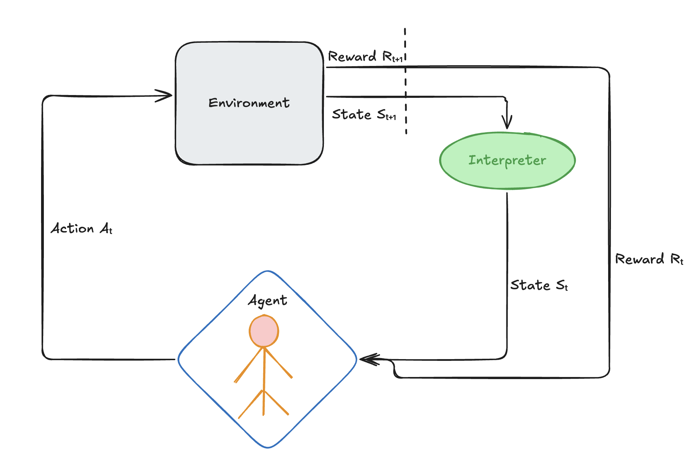

### Exploration and Exploitation ###

One of the trade-offs and challenges in reinforcement learning is *Exploration* and *Exploitation*. As mentioned before, the agent tries to reach the goal by taking actions that provide maximum reward. But to discover such actions, it has to explore other possible actions. One might wonder, why not try all actions and choose the one that is the best. This is often computationally not feasible because of the vast number of states and actions (Backgammon approximately has 10^20^ states). Even if the agent has tried all the actions applicable in a state in the past and has the knowledge of the best action, it still has to try other actions if the environment is non stationary (environment changes with time).    

Hence, the dilemma; to explore or to exploit. In simple terms, exploit is to take decisions based on known knowledge and explore is to go down other path even when it is known the other action at this particular state might not yield the best possible reward in order to get better reward in the future. So, look out for exploration and exploitation in all the algorithms of reinforcement learning to better understand balancing of the trade-offs. One thumb rule is to have more weightage in favor of exploration if uncertainty is high and exploit otherwise.

### Elements of Reinforcement Learning ###

- **policy:** Mapping of perceived states to actions that are taken in those states.
- **reward signal:** Environment sends rewards to an RL agent upon taking action in a state at different time steps. This is usually a real number. The agent's objective is to maximize the total reward it gets in the long haul.
- **value function:** Reward is usually immediate, i.e, the agent gets the reward after taking an action in a particular state at a particular time. Value Function, however, tells what is the expected rewards an agent can achieve from the said state in the long run. Based on values, decisions are made, i.e, an agent takes actions that produce highest value.

Apart from these three, optionally, *model* can also be considered as an element. The model imitates the environment, i.e, given an action in a state, the model predicts the next state and reward. This learning that uses *planning* and *models* is called model-based learning where future states or situations are considered without even experiencing it. In contast, model-free methods are usually considered opposite of planning, where an agent learns explicitly by trial-and-error.

## Tabular Solution Methods ##

In the case where state and action spaces are relatively small, they can be represented in an array or a table. This gives an opportunity to understand the core ideas of RL algortihms, atleast in their simplest forms.

One more feature that distinguishes RL from other learnings is that it learns on training information that *evaluates* the actions rather than *instruct* the action in a particular state at a specific time. This creates the need for active exploration.

In this problem, evaluative feedback is presented in the simple setting, where the agent has to learn to act only in one situation (non-associate setting), i.e, n-armed bandits problem.

## N - Armed Bandit Problem ##

N - arm bandits refers to a *casino slot machine* where instead of one lever, there are n levers (actions). After each action selection, there is a reward according to the stationary probability distribution. The agent's goal is to maximize total reward over m steps. In this case, 1000 steps, and thereby selecting 1000 actions.

Here casino slot is referred, however, there are many applications of the same. For instance, the same problem can be formulated for online advertising; 
- **n-arm or actions:** n-ads.
- **rewards:** clicks, purchases, etc. 
- **goal:** Maximize total engagement over time.

Python is used to implement the solution. In the below image, the bandit class is initialized with *k* arms or actions. The *k* actions are assigned normally distributed rewards with mean 0 and variance 1. It also has *pull* method that takes an action and returns the reward that has some additional noise. This is due to the fact that real-world actions often have uncertainty. In this instance, pulling a casino lever may not give same payout every time.

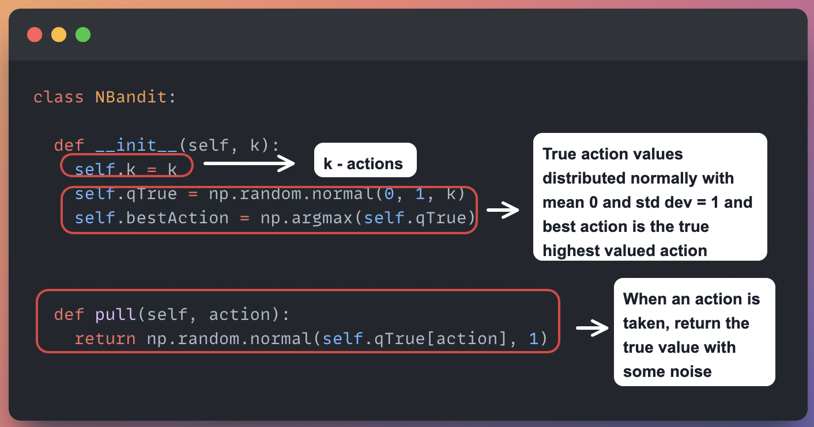

There are multiple solutions to this problem. In this articles, three of them will be discussed; *ε-greedy*, *Upper Confidence Bound*, *Thompson Sampling*.

These are also known as action selection methods as the agent is choosing different actions with unknwon rewards.

## **ε-greedy** ##

Let *q(a)* represent true value, and *Q(a)* for estimated value. Simple way to estimate *Q(a)* is to average the rewards when that particular action is selected. If action *a* has been chosen *$N_t$(a)*, getting rewards *$R_1$, $R_2$, $R_3$, ...., $R_{Nt(a)}$*, then 

  

<b>Equation (1):</b> Sample average estimate of action value

If $N_t(a) = 0$, then $Q_t(a)$ is defined as some default value. In this problem we define it as 0. If $N_t(a)$ tends to ∞, then by law of large numbers, $Q_t(a)$ converges to its true value *q(a)*.

The obvious choice to select action is the one with the highest $Q_t(a)$, this is also known as *greedy* action selection. As it was made clear in the earlier sections, the algorithm has to balance exploration and exploitation. Hence, the agent selects one of the actions randomly with equal probability regardless of the estimate. This is done with probability ε, and with probability 1-ε, the action with the highest estimate is selected.

To have incremental update to the simple average estimate, modifying the above formula, we have

  

<b>Equation (2):</b> Incremental average estimate of action value

Notice that it is *$R_t$* and not *$R_{t+1}$* as *$Q_1=0$*. Alpha(𝛼) is the step size parameter that is equal to $N_t(a)$. Below is the image of implementation details in python.

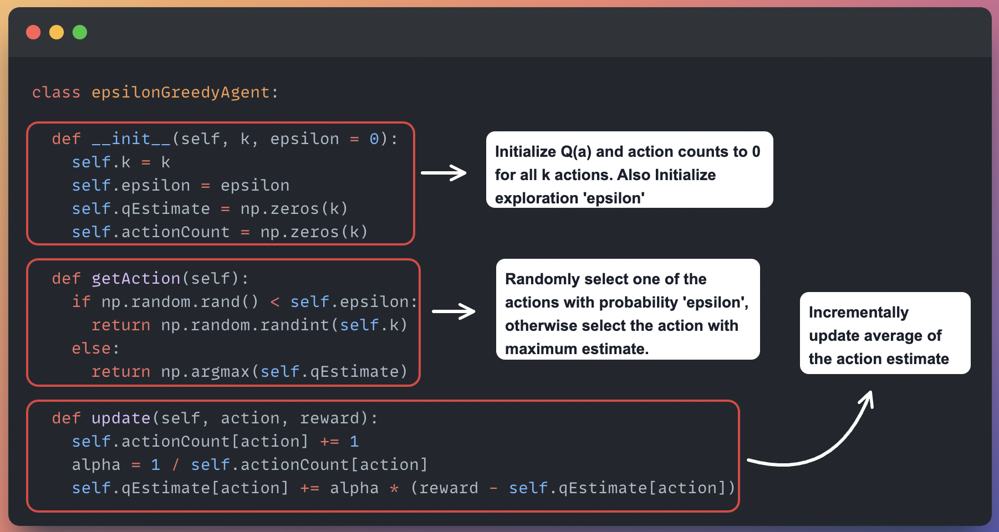

Now that we have the set-up, let us simulate the experiment. One more thing to note here is that, the experiment is carried out 2000 times, with 1000 steps or iterations each time. These are then averaged out to get the better approximate. This set up will help in visualizing the performance much better (A single run can be extremely noisy and can lead to misleading conclusions especially since the problem has inherent randomness and the agent can get lucky or unlucky based on initial estimates. So, many runs are performed and then averaged to get clear picture). Find the implementation in the picture below.

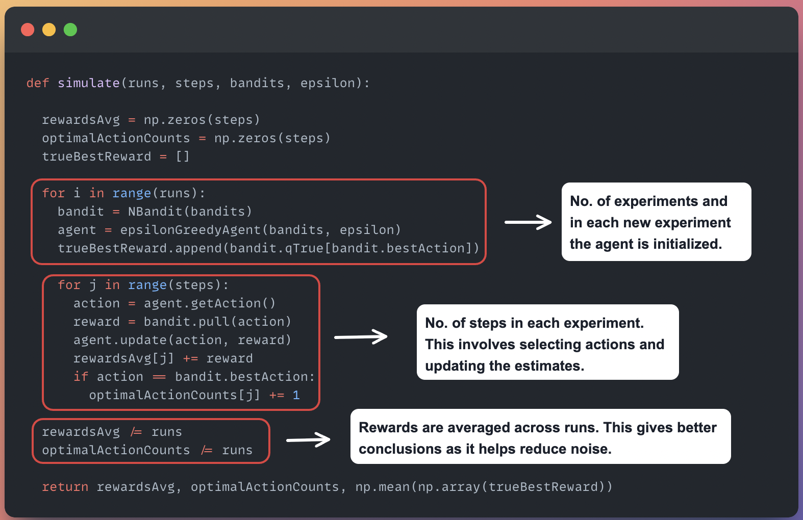

Now, let's runt the algorithm.

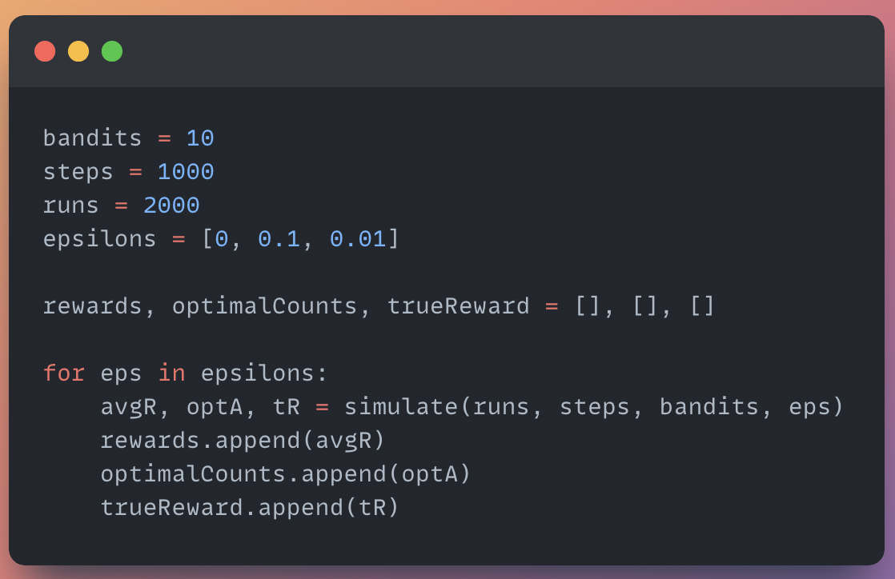

### ε-greedy Results ###

Now that the algorithm is familiarized, let us look into results.

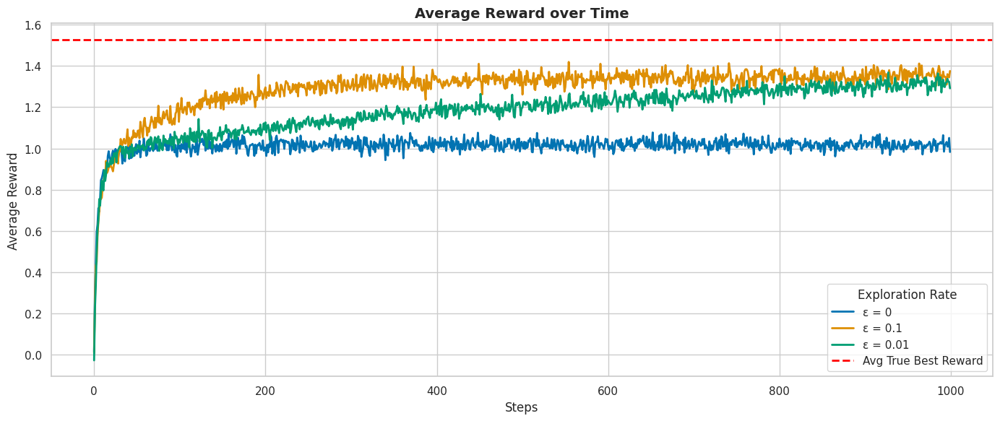

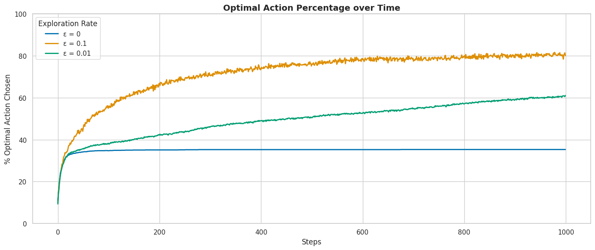

The above plots give a lot of information as to the performance of greedy and ε-greedy methods. As seen, greedy implementation (ε=0) gets stuck at about 1, when the best reward is around 1.55. This however, depends on the task, if the reward had 0 variance instead of 1, then greedy would instantly after trying that action. On the contrary, it would perform extremely poor if the variance was higher as it needs more exploration. One more thing to note here is that the ε=0.01 eventually performs better than ε=0.1 in both metrics. Also, ε=0.1 would never have optimal action selection more than 91% of the time, because it explores other action 10% of the times and in that the best action might be selected 10% of the time.

### Tracking Non - Stationary Problem ###

The above implementation works well when the problem is stationary, however, if the environment changes over time, i.e, there is new best action after *t* steps, then, even ε-greedy would take a lot of steps to correct the course as the sample-average method implemented above is unbiased; it considers all rewards as equally important. In non-stationary problem, we need an agent that gives more *weightage* to recent rewards than the earlier ones. This can be achieved simply by having constant alpha in Equation 2. Here 𝛼 belongs to (0, 1]. 

If 𝛼 is near 0, then the new rewards have very little influence marking slow learning. If it is near 1, then new rewards have very high influence in updating the estimates.

### Optimistic Initial Values ###

The above formulations have bias to the initial estimate, although for sample-average methods the bias disappears early, for constant *step-size (𝛼)*, the bias decreases very slowly over time and it will be permanent if very few steps are in each run. 

This is not bad all the times, as it might lead to natural exploration without the need for ε. If the initial values are higher (optimistic), then when the agent starts getting reward that is lower (true rewards), the agent looks for other actions as the other action still have higher value, thanks to the optimistic start.

With the below plots, it can be seen that even if ε=0, the agent manages to get much closer to true reward and even has much higher optimal action selection percentage than before. This set up was done with constant alpha of value 0.1. The results can also be verified for sample-average methods as well i.e, 𝛼 = 1/N (the plots might not be the same, but the performance is still far better than without optimistic initialization).

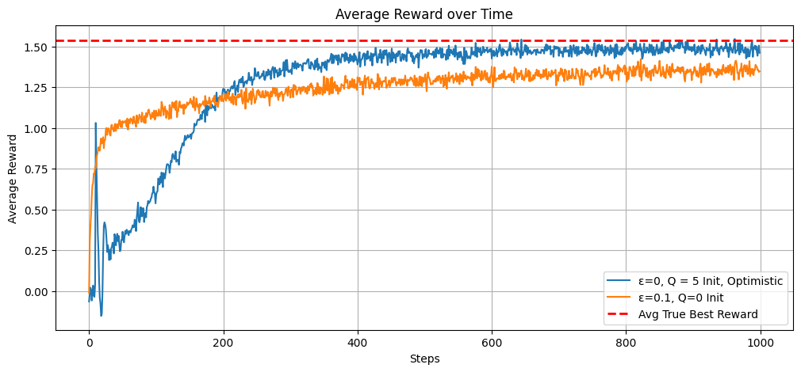

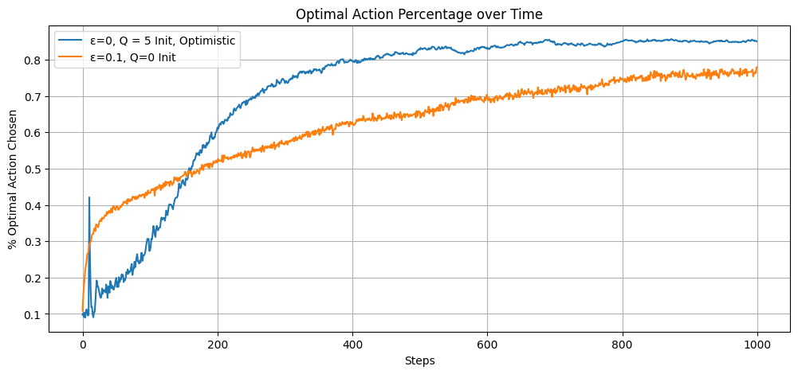

## Upper Confidence Bound (UCB) ##

Exploration is essential when the action value estimates have uncertainty. While ε-greedy mitigates this problem to a great extent as seen previously, it does so, randomly, without considering the promising nature of the action, i.e, we would like to explore actions that have high chance of being closer to optimal or have higher uncertainty as they might potentially be the optimal or best choice.

  

<b>Equation (3):</b> UCB 

UCB is an effective way of doing this. This is the action selection rule used in UCB algorithms, where:

- $Q_t(a)$ is the estimated value of action 𝑎 at time *t*
- $N_t(a)$ is the number of times action a has been selected up to time 𝑡, same as before.
- c is a hyperparameter controlling the level of exploration.

*Square root* term is the measure of uncertainty and decides exploration (along with c). If $N_t(a)$ is small then square root term is big, making the agent **explore** this action. Smaller c means more exploitation, larger c makes the agent explorer. This might, however, shrink overtime as enough information about action is known. This can also be considered as *uncertainty bonus*.

From below graphs, it can be seem UCB performs better than ε-greedy for both metrics.

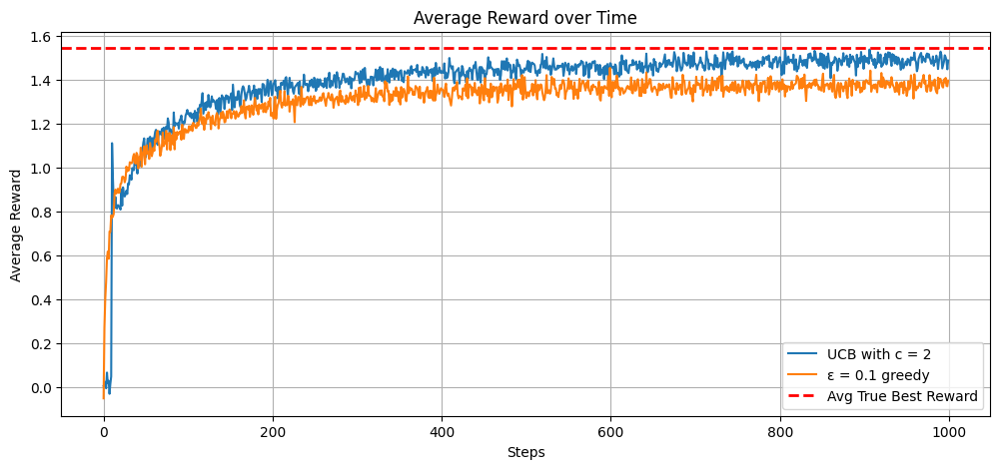

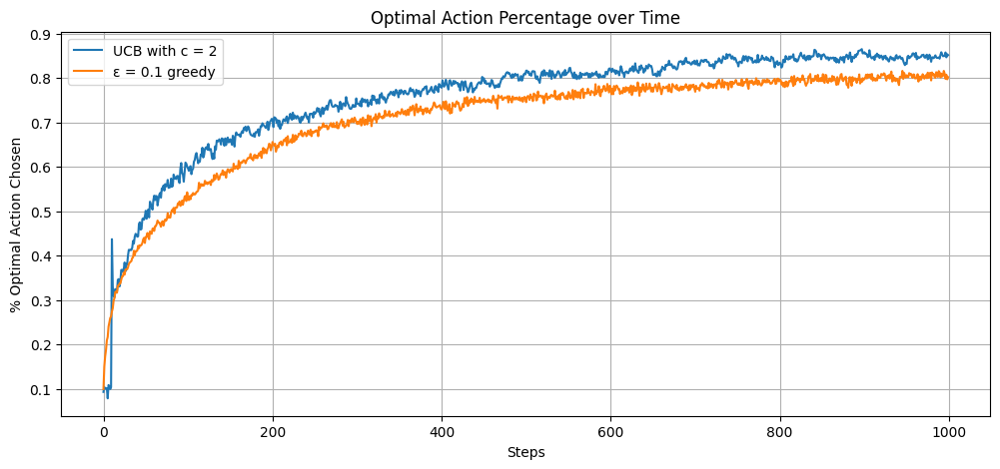

One thing to note here is that the equation 3 is for action selection, the update rule even for UCB is same as equation 2. 

Even though UCB performs better than ε-greedy, the difficulty arises in non-stationary problem and it is more complex to implement in this case than the techniques mentioned before (regardless of the fact that 𝛼 is constant, the exploration bonus still decays irreversibly with $N_t(a)$). In functional approximation methods with advanced settings, there is no known implementation of UCB action selection.

## Gradient Bandits ##

**Gradient Bandits** are a class of algorithms in reinforcement learning that take a different approach from estimating action values (like Q-values). Instead of learning the expected reward of each action, they learn preferences $H_t(a)$ for actions, and use these preferences to form a probability distribution over actions. The probability of selection is proportional to the preference. 

Here, the numerical value of preferences do not hold much meaning, only its relative value to other actions.

The preferences are converted to probabilities using softmax function.

  

<b>Equation (4):</b> Gradient Bandit Softmax Policy

Initially, all probabilities are same so that  all actions have an equal probability of being selected, i.e, H(a) = 0 for all actions.

*Stochastic Gradient Ascent* is used to update the preferences (stochastic gradient descent as in most supervised learning algorithms so as to minimize the loss, here we are trying to maximize the expected reward).

  

<b>Equation (5):</b> Preference update for the selected action in Gradient Bandits

  

<b>Equation (6):</b> Preference update for non-selected actions in Gradient Bandits

Typically 𝛼 is constant in gradient bandits implementation. One more thing to pay attention here is that  the average reward $\bar{R}_t$ , is the average of all rewards received up to time t, regardless of which action was taken. $\bar{R}_t$  is also the **baseline**. Baseline is a reference value used to reduce the variance of the updates to the preference values.

With mathematical calulations, it can be shown that gradient bandits solution has robust convergence properties.

